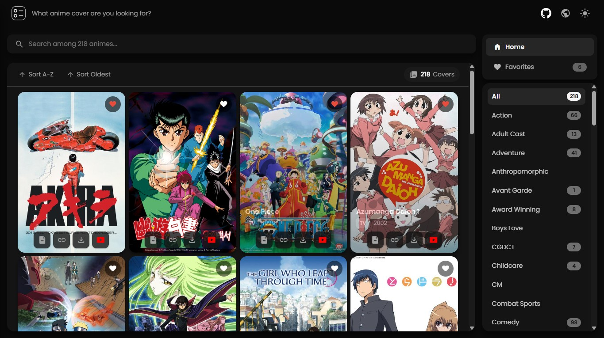

# Anime Cover Catalog

A web application for browsing and discovering anime cover art. Built with Angular, this catalog provides an intuitive interface to explore, search, and organize anime artwork.



## Features

- **Browse Anime Covers**: View a gallery of high-quality anime cover images organized by various categories
- **Advanced Filtering**: Filter anime by genre, demographic, theme, and type (TV, Movie, OVA, Special, etc.)
- **Search Functionality**: Quickly find specific anime titles with real-time search
- **Sorting Options**: Sort by name (A-Z, Z-A) or release date (newest, oldest)
- **Favorites System**: Save your favorite anime covers with persistent local storage
- **Dark/Light Theme**: Toggle between dark and light modes for comfortable viewing
- **Responsive Design**: Optimized for desktop and mobile devices
- **Anime Details**: View detailed information including episodes, genres, demographics, and themes
- **Trailer Support**: Watch anime trailers directly within the application
- **Image Download**: Download high-resolution cover images

## Technology Stack

- **Framework**: Angular 20.3.14
- **Language**: TypeScript 5.8
- **Styling**: CSS with CSS Variables for theming
- **State Management**: Angular Signals
- **Routing**: Angular Router with lazy loading
- **Icons**: Google Material Symbols (Rounded)
- **Analytics**: Vercel Web Analytics

## Development

### Prerequisites

- Node.js (v22.21.1 or higher)
- npm (v11.6.4 or higher)

### Installation

```bash
npm install
```

### Development Server

```bash
ng serve
```

Navigate to `http://localhost:4200/`. The application will automatically reload when source files change.

### Building

```bash
ng build
```

Build artifacts will be stored in the `dist/` directory. The production build optimizes the application for performance.

### Running Tests

```bash
ng test
```

## License

This project is licensed under the MIT License - see the [LICENSE](LICENSE) file for details.
